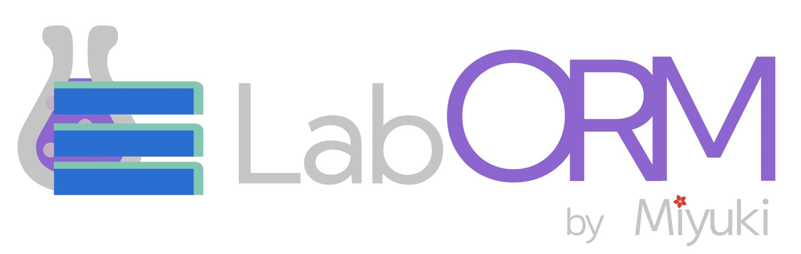

#

An experimental object relation model generator for NodeJS + TypeScript

## How to get started?

Define a schema file, of course, here's an example:

```
@engine sqlite3 {
    file: "test.db"
}

model Users {
    id Int Primary AutoIncrement
    name String

    age Int Default 0
}

model Posts {
    id Int Primary AutoIncrement

    title String
    body String
}
```

And with a simple command.. `laborm migrate` You will have a database ready to use!

## Using the generated client

TODO! really! still re-coding this after the refactor i made!

## TODO

- [x] Improve the entire code
- [ ] Documentation
- [x] Schema Parsing
- [x] Diff detection
- [x] Migration application
- [ ] Client Generation
- [ ] A better query system
- [ ] Insert or Update
- [ ] UPDATE
- [ ] DELETE
- [x] Foreign Keys
- [ ] @import statements in schemas for multiple schema files
- [ ] Allow inspection of existing databases to generate a schema from

## Todo for the very, very long future ahead:

- [ ] Prisma Schema conversion
